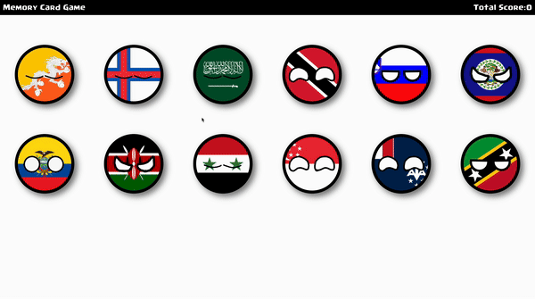

# 🃏 MemoryCardGame

[](https://github.com/arysaikyn/MemoryCardGame/#readme)

> A memory card game developed using React.js.
> Inspired by country balls and utilizing TypeScript, Vite, React, and the [REST Countries API](https://restcountries.com/).
> Developed for The Odin Project's [curriculum](https://www.theodinproject.com/lessons/node-path-react-new-memory-card).

## ✨ Demo
[](memory-card-game-azure.vercel.app)

## 📜 Docs

### Install

```sh
npm install
```
Installs dependencies.

### Start

```sh
npm run dev
```
Starts the development server with Vite.

### Test

```sh
npm run test
```
Runs the tests with Jest.

### Watch

```sh
npm run watch
```
Runs the test runner in watch mode.

### Build

```sh
npm run build
```
Builds the app for production to the `dist` directory.

## 🚀 Manual Deployment

[Deploy to GitHub Pages from `dist` directory](https://gist.github.com/cobyism/4730490).
1. Remove the `dist` directory from `.gitignore`.

2. Create production bundle:

```sh
npm run build
```

3. Make sure git knows about your subtree (the subfolder with your site).

```sh
git add dist && git commit -m "Initial dist subtree commit"
```

4. Use subtree push to send it to the `gh-pages` branch on GitHub.

```sh
git subtree push --prefix dist origin gh-pages
```

## 📖 Lessons Learned

- **Understanding Project Setup**: Learned to create a new React project from scratch and organize the folder structure effectively.
- **Component Planning**: Gained experience in planning features and components required for a project, including managing and structuring them within a React application.
- **State Management with Hooks**: Utilized React hooks to manage and utilize state efficiently within the application.
- **API Integration**: Implemented fetching data from an external API, such as Giphy or the Pokemon API, and displaying this data within the application.
- **Dynamic Card Display**: Created functionality to display cards randomly and ensured this function is invoked when the component mounts.
- **Scoreboard Implementation**: Developed a scoreboard to track the current and highest scores achieved, enhancing the game’s interactivity.
- **Styling and Presentation**: We focused on styling the application to make it visually appealing and ready for showcase.
- **Deployment and Version Control**: Pushed the project to GitHub and learned the steps for deploying the application, ensuring it is accessible online.
- **Community Engagement**: Understood the importance of community contributions and open-source projects in enhancing learning and development.

## Author

👤 **Arys Aikyn**

* GitHub: [@arysaikyn](https://github.com/arysaikyn)
